# Introduction { .intro }

You are going to learn how to make a timer, so that you can use it to challenge your friends!

# Step 1: Setting up your timer { .activity }

Let's set your timer to 0 when buttons A and B are pressed together.

## Activity Checklist { .check }

+ Go to <a href="http://jumpto.cc/mb-new" target="_blank">jumpto.cc/mb-new</a> to start a new project in the Code Kingdoms editor. Call your new project 'Timer'.

+ Drag the `onStart` event (including the comment) into the bin, as you don't need it.

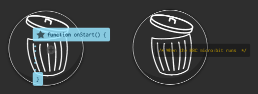

+ Click 'Add Event' and create a new `onPressAandB` event.

+ Click the 'Library' tab and then 'Globals', and create a new variable called `time`.

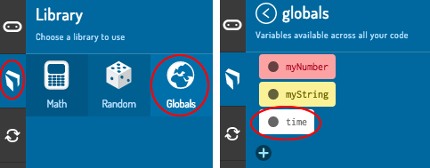

+ When buttons A and B are pressed together, you want the `time` to be set to `0`. To do this, drag your `time` variable into your `onPressAandB` event.

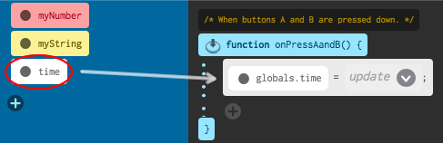

+ Click the `update` arrow, choose `# number` and enter `0`.
	
	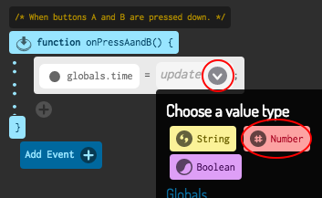

	Here's how your code should look:

	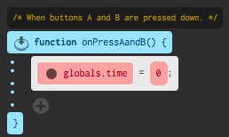

+ You should also display the `time`. To do this, drag in a `say` block, click the `value` arrow and choose your `time` variable.

	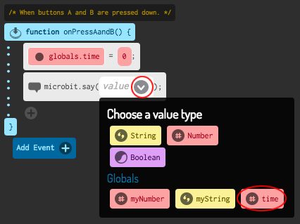

+ Click 'run' to test your code. Press the 'A+B' button (below the micro:bit) to set your timer to 0.

	

# Step 2: Starting and stopping your timer { .activity }

Use button A to start your timer, and button B to stop it.

## Activity Checklist { .check }

+ Your timer should start when button A is pressed. Add a new `onPressA` event to your script.

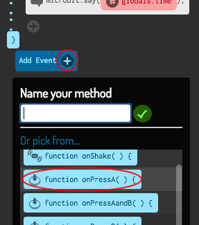

+ The timer should count up as long as button B __has not been pressed__. To do this, first drag a `while` block unto your new `onPressA` event.

+ Click the `test` arrow, and choose `! value` (`!` means __not__).

+ You can then drag a `buttonBPressed` block into the `value` gap in your `while` loop.

	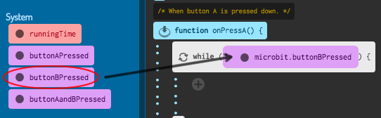

	Any code inside this `while` loop will be run repeatedly, __as long as button B has not been pressed__.

+ Next, you want to add 1 to your `time` variable every second (1 second = 1000 ms). Add a `wait` block to make your timer wait for 1 second.

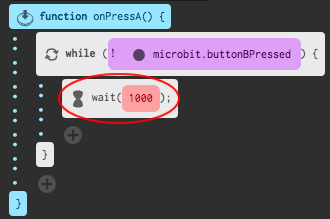

+ To increase your `time` variable, drag in the variable, click the `update` arrow and click `left + right`.

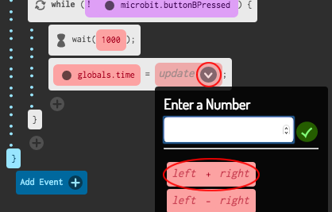

+ Click the `left` arrow and choose your `time` variable.

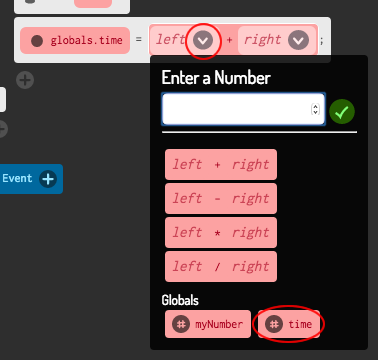

+ Click the `right` arrow and enter `1`. This will add 1 to the current value of `time`.

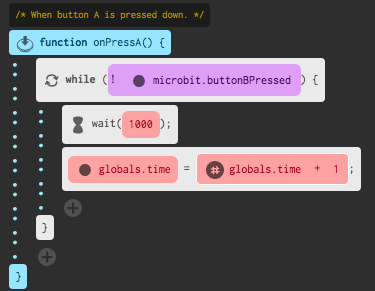

+ Finally, you'll need to display the updated `time` variable. Here's how your code should look:

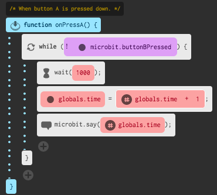

+ Click 'run' to test your code.

	+ Press buttons A and B together to est your timer to 0
	+ Press button A to start your timer
	+ Press (and hold) button B to stop your timer.

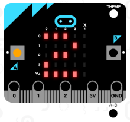

## Challenge your friends! { .challenge }
Use the timer to challenge yout friends. For example, you could see how long it takes them to say the alphabet backwards, or name 10 capital cities.

## Challenge: Counting Down { .challenge }
Can you create a __new__ timer, that counts down to 0? Here's how your new timer should work:

+ Pressing buttons A and B together should set your `timer` to 0

	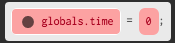

+ Pressing button B should add 1 to your timer

	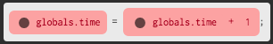

+ Pressing button A should take 1 from your `time` variable until it gets to 0. This means you'll need a `while` loop that runs as long as the `time` is greater than (`>`) 0.

	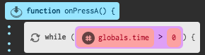