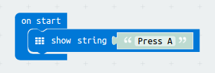
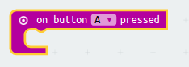
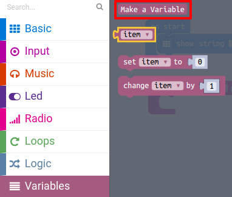
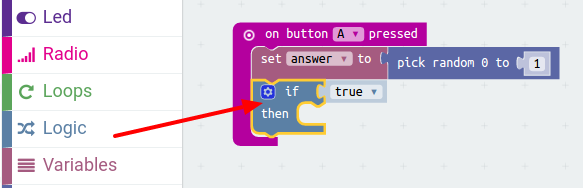
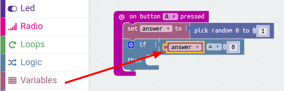
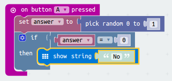
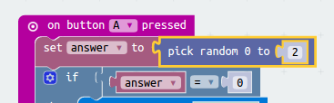

# Introduction { .intro }

You are going to code your micro:bit to read the future! Simply ask the micro:bit a question, and press a button to find out the answer!

__Instructions__: If you're reading this online, ask the micro:bit below a question and press __A__ to get your answer!

<iframe style="position:absolute;top:0;left:0;width:100%;height:100%;" src="https://makecode.microbit.org/---run?id=18828-96734-17356-00995" allowfullscreen="allowfullscreen" sandbox="allow-popups allow-scripts allow-same-origin" frameborder="0"></iframe>

# Step 1: Scrolling text { .activity }

Let's start by scrolling some text instructions on your micro:bit.

## Activity Checklist { .check }

+ Go to <a href="http://jumpto.cc/pxt-new" target="_blank">jumpto.cc/pxt-new</a> to start a new project in the MakeCode (PXT) editor. Call your new project 'Fortune Teller'.

You can delete the `forever` block by dragging it over the palette, you don't need it for this project.

+ Drag a `show string` block inside your `start` start.

+ Test out your code. You can test it out in the emulator or on the micro:bit itself.

## Save your project { .save }

# Step 2: Making a decision { .activity }

Let's get your micro:bit to make a decision by randomly choosing a number (`0` for 'No' and `1` for 'Yes').

## Activity Checklist { .check }

+ Add a new `on button A pressed` event to your code.

+ Let's create a new variable to store the answer. Click the 'Variables' and then click 'Make a variable'.

+ Name the new variable called `answer`.

+ Drag a `set` block from Variables into your `on button A pressed` block and select the `answer` variable.

As you can see, the `to` in the block means that you can set the answer to display.

+ Click 'Math' and drag a `pick random` block after the `to`:

+ Tell the random block to choose a number between 0 and 1. Here's how your code should look:

+ Next, you want to display the word `No` on the micro:bit only `if` the `answer` is 0.

To do this, drag an `if` block onto the bottom of your `on button A pressed` event:

+ Next drag an `=` block as the condition in the `if`:

+ Drag your `answer` variable onto the left side of the `if` block.

+ Any code inside the `if` block will only run if the `answer` is 0. As 0 is `No`, let's add a `show text` block.

+ Test your code.
	+ Sometimes the `answer` will be 0, and the micro:bit should say 'No'.
	+ Sometimes the `answer` will be 1, and nothing will happen!

## Save your project { .save }

## Challenge: Multiple answers {.challenge}
Can you add code so that 'Yes' is displayed on your micro:bit __if__ the answer is 1? You can even change the text shown to something more interesting than just 'Yes' and 'No'!

You can even make your micro:bit say something like 'Maybe' or 'Ask again' if the answer is 2. To get this working, you'll also need to change your code to choose a random number between 0 and 2!

Tip: You can right-click on an `if` block to duplicate the block and its contents.

## Save your project { .save }

## Challenge: Shake your micro:bit {.challenge}
Can you code your micro:bit to make a decision when it is shaken instead of when a button is pressed?

## Save your project { .save }
