# Introduction { .intro }

You are going to code your micro:bit to read the future! Simply ask the micro:bit a quesition, and press a button to find out the answer!

# Step 1: Scrolling text { .activity }

Let's start by scrolling some text instructions on your micro:bit.

## Activity Checklist { .check }

+ Go to <a href="http://jumpto.cc/mb-new" target="_blank">jumpto.cc/mb-new</a> to start a new project in the Code Kingdoms editor. Call your new project 'Fortune Teller'.

+ Drag the `say` block inside your `onStart` event.

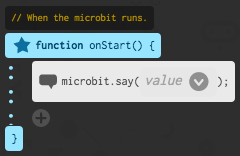

+ To add some text, click the down-arrow, and choose 'String'.

+ Add your instructions into the text box.

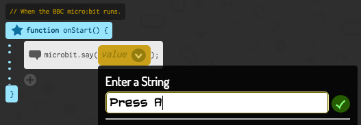

This is how your code should look:

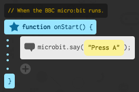

+ Test out your code. You can test it out in the editor or on the micro:bit itself.

+ The text in your `say` block scrolls quite slowly across the screen. To speed it up, you'll need to use __another version__ of the `say` block.

Delete your `say` block, so that your `onStart` event is empty.

+ Click the down arrow next to the `say` block and you'll see another a second block appear. Drag this block into the `onStart` event.

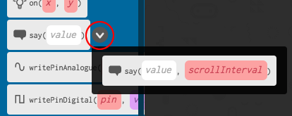

+ This version of the `say` block lets you decide how long (in milliseconds) to wait between scrolling. Type `10` into the text box. 

## Save your project { .save }

## Challenge: Fixing the scrolling text! {.challenge}
If you test your code again, you'll see that this time the text scrolls too quickly. Can you change the number in your `say` block so that the text scrolls at a good speed. 

## Save your project { .save }

# Step 2: Making a decision { .activity }

Let's get your micro:bit to make a decision by randomly choosiong a number (`0` for 'No' and `1` for Yes).

## Activity Checklist { .check }

+ Add a new `onPressA` event to your code.

+ Let's create a new variable to store the answer. Click the 'Library' icon and then click 'Globals'.

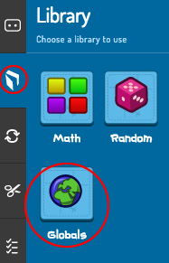

+ Click the `+` to create a new variable called `answer`.

+ Drag your new `answer` variable into your `onPressA` event.

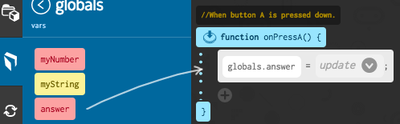

As you can see, the `=` in the block means that you can set the answer to display.

+ Click the 'Library' icon, and click 'Random'.

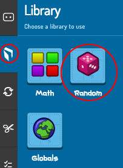

+ Drag the random `number` block on top of the word `update`.

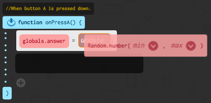

+ Tell the random block to choose a number between 0 and 1. Here's how your code should look:

+ Next, you want to display the word `No` on the micro:bit only `if` the `answer` is 0.

To do this, click the 'Language' tab and then drag an `if` block onto the bottom of your `onPressA` event.

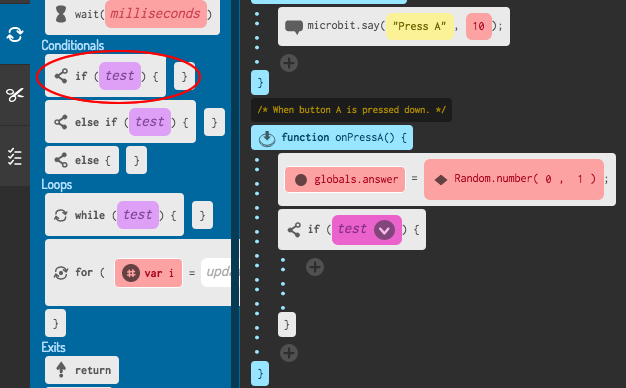

+ Click the down arrow on the `if` block and click `left == right`.

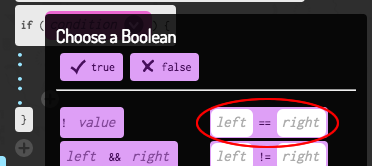

+ Drag your `answer` variable onto the left side of the `if` block, and type `0` into the right side.

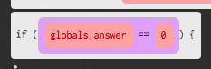

+ Any code inside the `if` block will only run if the `answer` is 0. As 0 is `No`, let's add a `say` block.

+ Test your code.
	+ Sometimes the `answer` will be 0, and the micro:bit should say 'No'.
	+ Sometimes the `answer` will be 1, and nothing will happen!

## Save your project { .save }

## Challenge: Multiple answers {.challenge}
Can you add code so that 'Yes' is displayed on your micro:bit if the answer is 1? You can even change the text shown to something more interesting than just 'Yes' and 'No'!

You can even make your micro:bit say something like 'Maybe' or 'Ask again' if the answer is 2. To get this working, you'll also need to change your code to choose a random number between 0 and 2!

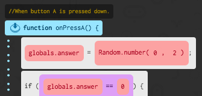

## Save your project { .save }

## Challenge: Shake your micro:bit {.challenge}
Can you code your micro:bit to make a decision when it is shaken instead of when a button is pressed?

## Save your project { .save }