# Introduction { .intro }

You are going to make a game in which players have to guide a wand along a course without making contact. Making contact will add one to the player's score - the player with the lowest score wins!

For this project you'll need some additional items:

+ Metal wire (approx. 50cm);
+ Putty;
+ Electrical tape (optional);
+ Crocodile clip leads (optional).

# Step 1: Storing fails { .activity }

Let's start by creating a place to store fails.

## Activity Checklist { .check }

+ Go to <a href="http://jumpto.cc/mb-new" target="_blank">jumpto.cc/mb-new</a> to start a new project in the Code Kingdoms editor. Call your new project 'Frustration'.

+ Drag the `onStart` event (along with the comment above it) into the bin.

+ A new game should start when the player presses button A. Click `Add Event` and then `onPressA`.

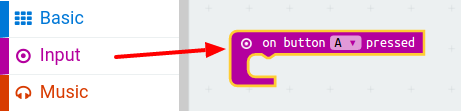

+ A __variable__ is a place to store data, such as the number of times the player has touched the wire. To create a new variable, click the 'Library' tab and then click 'Globals'.

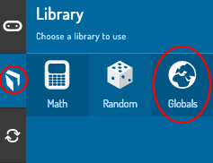

+ Click the '+' button, and create a new variable called `fails`.

+ You'll need to set the number of `fails` to 0 at the start of a new game. To do this, first drag your `fails` variable into your `onPressA` event.

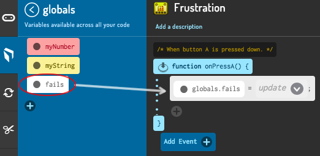

+ You can then set the number of fails by clicking the arrow on your `fails` block, clicking 'Number' and then typing `0`.

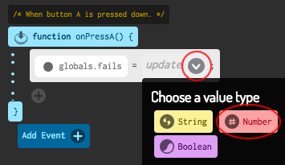

+ Finally, you can display the number of `fails` on your micro:bit. To do this, first drag a `say` block to the end of your script.

	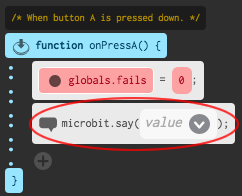

+ To display the number of `fails`, click the arrow on your `say` block and click on your variable.

	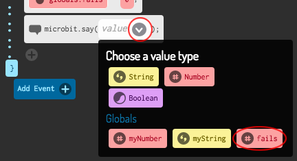

	Here's how your code should look:

	

+ Click 'run' to test your script. Clicking button A should display the number of fails, which has been set to `0`.

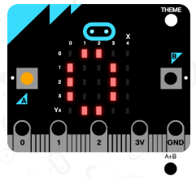

## Challenge: Display an image { .challenge }
Can you display an image for 1 second (1000ms) before the number of `fails` are displayed?

You'll need to use the `draw` and `wait` blocks do to this.

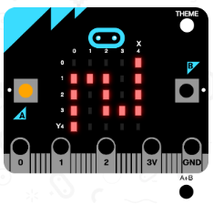

# Step 2: Keeping track of fails { .activity }

Let's add code to keep track of fails.

## Activity Checklist { .check }

+ You're going to add 1 to your `fails` variable every time a connection is made on Pin0. To do this, Click 'Add Event', and choose `onPinPress0`.

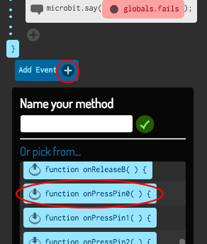

+ Next, add 2 blocks to display a cross for 1 second when Pin0 is pressed.

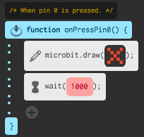

+ You'll then need to add 1 to your `fails` variable. To do this, click the 'Library' tab and then click 'Globals' and drag in your `fails` variable.

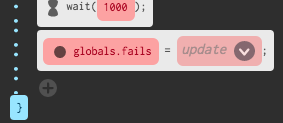

+ Click the `update` arrow, and choose `left + right`.

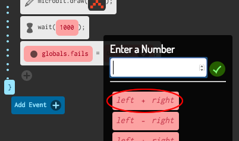

+ Click the `left` arrow and choose your `fails` variable.

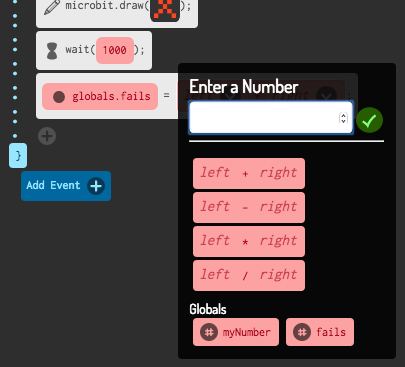

+ Click the `right` arrow and type 1. This means that your `fail` variable will add 1 to it's old value. Here's how your block should look.

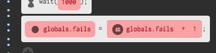

+ Finally, you can add code to display the updated number of fails. Here's how your code should look.

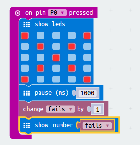

+ Click 'run' to test your code, and press button A to start your game. Each time you press Pin0 you should see your `fails` variable increase by 1.

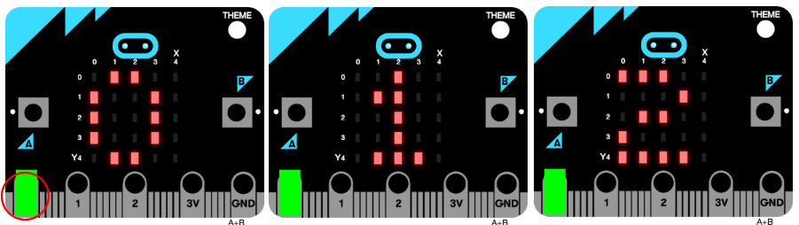

+ Click 'compile' and transfer your script onto your micro:bit. You can press Pin0 by completing a circuit. To do this, place your right thumb on the ground pin (GND) and then tap Pin0 with your left thumb.

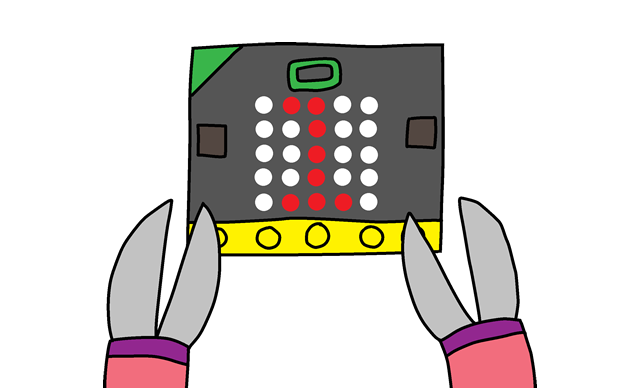

# Step 3: Building your game { .activity }

Now that you've coded your game, let's put it all together!

## Activity Checklist { .check }

+ First, let's make your wand. Take a piece of wire about 20cm long and bend it in half, making a loop at the top.

+ You can then twist the two pieces of wire together.

+ To make the course, take a piece of wire about 30cm long and bend the middle part of the wire into shape. You should bend up one end of the course.

+ If you have some electrical tape, wrap some around the two ends of the wire, leaving some exposed metal at both ends.

+ Slide your wand through your course, and push the ends of your wire into some putty to stand it up.

+ You can now connect your game to your micro:bit using a crocodile clip lead or some wire. Firstly, connect the ground pin (GND) to one end of your course.

+ You can then connect Pin 0 to your wand.

+ Test your game. Press button A and your score should be set to 0. Each time your wand touches the course, the circuit is completed and your micro:bit should add 1 to your number of fails.

## Challenge: Cheat mode! { .challenge }
Can you add a cheat to your game, so that pressing button B reduces your score by 1?

## Challenge: Personalise your game { .challenge }
Get some friends to try out your game. If your game is too easy, you can make it harder by:

+ Create a longer course;
+ Add more bends to your course;
+ Make a wand with a smaller gap.
