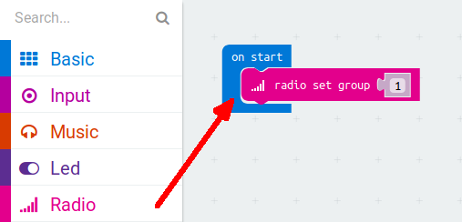
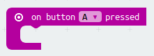
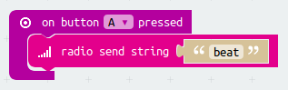
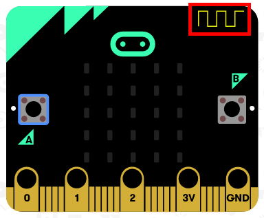
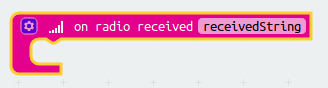
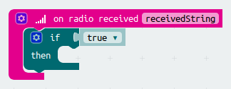
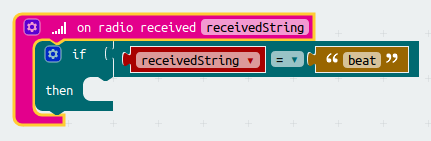
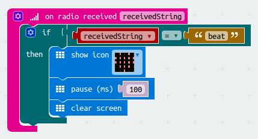
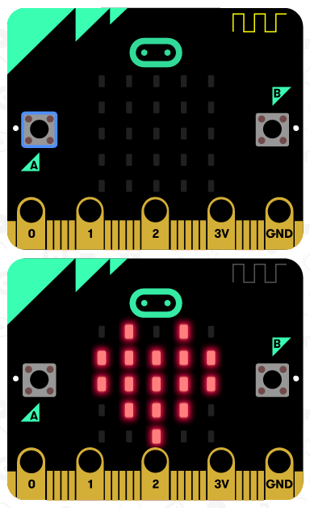

# Introduction { .intro }

In this project we need two micro:bits.
We will use one micro:bit as a heartbeat sensor and the other one as a display.
The two micro:bits will communicate using their radios.
One person will pretend to be a patient connected to a heartbeat monitor.
When they feel their heartbeat they press the A button.
The other person can pretend to be the nurse watching see the heartbeat on their micro:bit.
Since we're using the radios the nurse can be on the other side of the room.

__Instructions__: If you're reading this online, press __A__ on the micro:bit below to send a heartbeat to a second micro:bit

<iframe style="position:absolute;top:0;left:0;width:100%;height:100%;" src="https://makecode.microbit.org/---run?id=_0cT0je2sL0o7" allowfullscreen="allowfullscreen" sandbox="allow-popups allow-scripts allow-same-origin" frameborder="0"></iframe>

# Step 1: Sending a message { .activity }

Let's make the micro:bit send a radio message when button A is pressed.

## Activity Checklist { .check }

+ Go to <a href="http://jumpto.cc/pxt-new" target="_blank">jumpto.cc/pxt-new</a> to start a new project in the MakeCode (PXT) editor. Call your new project 'Heartbeat'.

+ Delete the `forever` block, as we don't need it.

+ Drag a `radio set group` block (Radio section) and choose a group to belong to.

+ Add a new `on button A pressed` event to your code.

All the micro:bits in this group will talk to eachother so pick a unique number if other people are also using their micro:bit radios!

+ Drag a `radio send string` block into the `on button A pressed` block.

+ Click 'run' to test your code. Press the 'A' button and see the antenna flash when the message is sent.

# Step 2: Receiving a message { .activity }

When we a micro:bit receives the 'beat message', let's show a heart symbol.

## Activity Checklist { .check }

+ Let's add a new `on radio received` block.

This block creates a new variable 'receivedString'.

+ We want to check if the received message was a 'beat'. To do this drag in an `if` block.

+ Drag in a comparison block (Math section), a variable block (Variables section) and a string block (Advanced > Text section) to check the value of 'receivedString'.

+ Now we can add some of the blocks we've used before to flash a heart icon.

+ Click 'run' to test your code. Now when you press the 'A' button a second micro:bit will show an flash a heart!

## Challenge: Fall detector { .challenge }

Can you make the transmitting mico:bit send a different message when a shake is detected?
Make the receiving microbit show an exclamation mark when this occurs.
Perhaps the patient has fallen out of their bed!

## Challenge: No heartbeat detected { .challenge }

Can you make the receiving micro:bit show a sad face if no heartbeat is detected within 5 seconds?
The patient needs immediate attention! (Or the sensor fell off).
