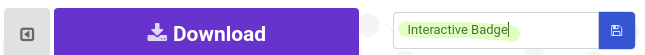
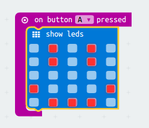
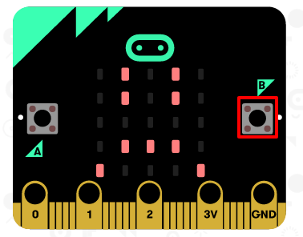
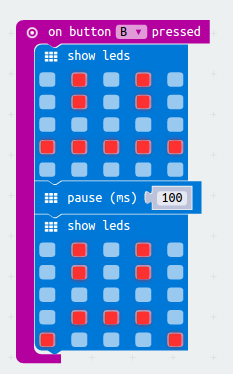
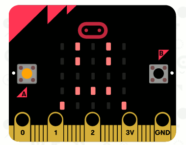

# Introduction { .intro }

You are going to make an interactive badge, that will show your mood to your friends.

<iframe style="position:absolute;top:0;left:0;width:100%;height:100%;" src="https://pxt.microbit.org/---run?id=90418-17495-16581-63753" allowfullscreen="allowfullscreen" sandbox="allow-popups allow-scripts allow-same-origin" frameborder="0"></iframe>

Press button A to change to a sad face and button B to change to a happy face. 

# Step 1: Displaying an image { .activity }

Let's start by showing an image on your micro:bit when it's powered on.

## Activity Checklist { .check }

+ Go to <a href="http://jumpto.cc/pxt-new" target="_blank">jumpto.cc/pxt-new</a> to start a new project in the PXT editor. Call your new project 'Interactive badge'.

+ You should now see the code editor. To draw an image on your micro:bit when it's powered on, drag a `show leds` block from the code area (on the left) inside the `start` block.

+ To create an image to display, click on leds that you want to light up:

+ Your code will run automatically in the emulator on the left:

+ You can also test your code on the micro:bit itself! To do this, click 'Download' on the menu at the left of the screen.

This will create and download a `.hex` file that will run on your micro:bit.

+ Use the USB cable to plug your micro:bit into your computer. You should then see your micro:bit appear in your computer's file manager as a USB drive. 

+ If you are using the micro:bit uploader then the `.hex` file will be automatically copied to the micro:bit. Check with your volunteer if you're not sure. 

Otherwise you will need to copy the `.hex` file to the micro:bit.

If you are using __Internet Explorer__ you can choose `Save as` from the menu that appears at the bottom of your browser and then select the micro:bit drive:

If you are using __Google Chrome__ you can click on the arrow after the downloaded file and choose 'Show in folder' and then drag the highlighted file to the micro:bit drive:

+ A light on the back of your micro:bit will flash while the file is being copied. Once this has stopped your program will run. You can click the reset button on the back of your micro:bit to restart the program.

+ You should now see your image on the micro:bit. If you prefer, you can remove the USB cable from your micro:bit, and attach the battery. The program will be saved on the micro:bit.

## Save your project { .save }

You don't need an account to save your stuff! Your project will automatically be saved in the browser, you can click on `Projects` to see your projects. 

You can also click save to download your project as a `.hex` file which contains your project:

To load your project on another computer, click 'Projects' and then 'Import file' and select your `.hex` file.

# Step 2: Displaying a happy face { .activity }

Let's show a happy face on your micro:bit when the 'A' button is pressed.

## Activity Checklist { .check }

+ So far, you've only run code when the micro:bit is powered on. You can also run code when a button is pressed.

Drag an 'on button pressed' block from input and make sure 'A' is selected:

Any code added inside this block will run when the 'A' button on your micro:bit is pressed.

+ Drag another `show leds` block inside your new event, and draw a happy face pattern.

+ Test our your new code in the emulator. Press the 'A' button and you should see a happy face on your micro:bit:

You can also test out your new code on your micro:bit.

## Save your project { .save }

## Challenge: Displaying a sad face {.challenge}
Can you make your micro:bit display a sad face when the 'B' button is pressed? You'll need to use another 'on button pressed' block to do this and select 'B'. 

## Save your project { .save }

# Step 3: Creating a simple animation { .activity }

Let's create a (very) simple animation for your happy and sad faces.

## Activity Checklist { .check }

+ Add a second `show leds` block to your `on button A pressed` block, with a neutral face.

+ If you run this code to test it, you'll notice that the pattern changes quickly. For a longer delay, you'll need to add a `pause` block between the two images being displayed.

To choose how many milliseconds to wait, click the down-arrow and enter a number. 1000 milliseconds is 1 second, so 250 milliseconds is a quarter of a second.

+ You'll also need to animate your sad face. The easiest way to do this is to duplicate the blocks you've just created. Right-click on a block to duplicate it. Note that the PXT editor just duplicates one block at a time (not multiple blocks like Scratch.)

+ You can then drag these blocks into your `on button B pressed` block. This is how your code should look:

+ Test your code, and you should see your animated happy and sad faces when you press button A and B.

## Save your project { .save }

## Challenge: Create your own interactive badge! {.challenge}
Create your own badge - you can use any images or animations you like!

## Save your project { .save }

