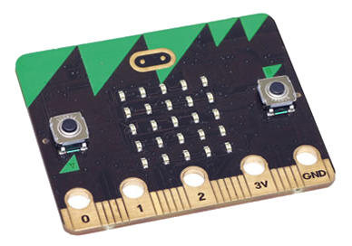

# Introduction { .intro }

You are going to make an interactive badge, that will show your mood to your friends.

# Step 1: Getting started { .activity }

## Activity Checklist { .check }

+ login to editor

# Step 2: Displaying an image { .activity }

## Activity Checklist { .check }

+ code for drawing image (diamond)
+ test in emulator
+ code for event button A press
+ test

## Save your project { .save }

## Challenge: Changing the image displayed {.challenge}
change to be happy face

# Step 3: Simple animation { .activity }

## Activity Checklist { .check }

+ duplicate image and edit
+ add `pause` and explain
+ test
+ animated text (explain interval - "i'm happy")

## Save your project { .save }

# Step 4: Getting your program onto the micro:bit { .activity }

## Activity Checklist { .check }

+ make sure it's working
+ press compile
+ plug in micro:bit
+ drag
+ reset
+ test

## Challenge: Adding more interactivity {.challenge}
Can you make your micro:bit show a sad face when the 'B' button is pressed? 

## Save your project { .save }

## Challenge: Make your own badge! {.challenge}
Anything you like... It could be images, scrolling text or even a simple animation.

## Save your project { .save }

## Now you can... {.challenge}
+ idea1
+ idea2
+ ...