# Introduction { .intro }

You are going to make an interactive badge, that will show your mood to your friends.

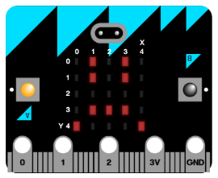

# Step 1: Displaying an image { .activity }

Let's start by showing an image on your micro:bit when it's powered on.

## Activity Checklist { .check }

+ Go to <a href="http://jumpto.cc/mb-new" target="_blank">jumpto.cc/mb-new</a> to start a new project in the Code Kingdoms editor. Call your new project 'Interactive badge'.

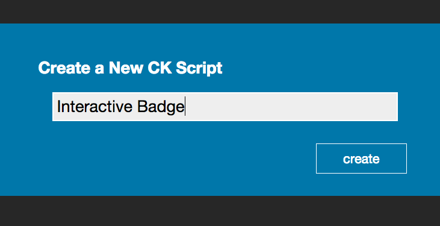

+ You should now see the code editor. To draw an image on your micro:bit when it's powered on, drag a `draw` block from the code area (on the left) inside the `onStart` event.

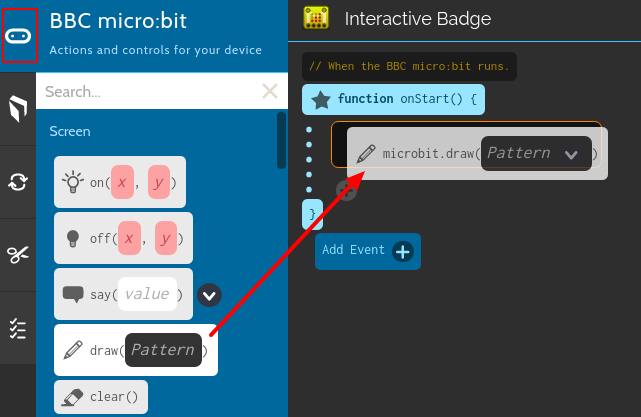

+ If you make a mistake, you can drag the code block into the bin.

+ To create an image to display, click the down-arrow next to the word `pattern`. You can choose an image to display, or even draw your own.

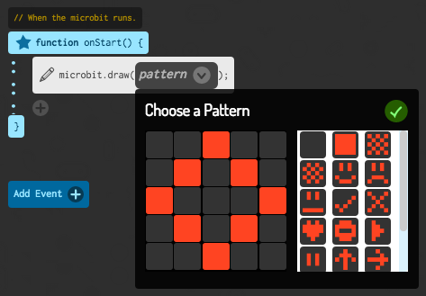

+ To test your code, click 'run' in the menu at the bottom of the screen.

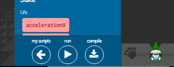

+ You should then see your image on the micro:bit, to the right of the editor.

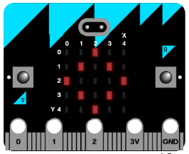

+ You can also test your code on the micro:bit itself! To do this, click 'compile' on the menu at the bottom of the screen

This will create and download a `.hex` file that will run on your micro:bit.

+ Use the USB cable to plug your micro:bit into your computer. You should then see your micro:bit appear in your computer's file manager as a USB drive. 

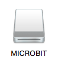

+ Drag the `.hex` file onto the micro:bit drive that appears.

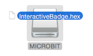

+ A light on the back of your micro:bit will flash while the file is being copied. Once this has stopped, click the reset button on the back of your micro:bit.

+ You should now see your image on the micro:bit. If you prefer, you can remove the USB cable from your micro:bit, and attach the battery.

## Save your project { .save }

To save your project, click 'my scripts' at the bottom of the editor.

You should then see a list of all your projects. To make sure your projects are saved, you'll need to sign in. The link to do this is in the top-right of the browser.

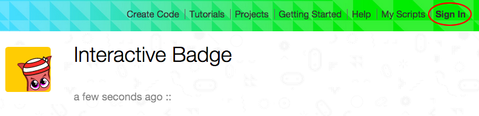

To go back to your project, just click on your interactive badge project and click 'edit'.

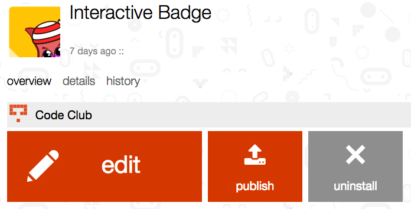

# Step 2: Displaying a happy face { .activity }

Let's show a happy face on your micro:bit when the 'A' button is pressed.

## Activity Checklist { .check }

+ So far, you've only run code when the micro:bit is powered on. To run code when a button is pressed, you'll need to add a new __event__.

Click 'Add Event' and then choose the `onPressA` event.

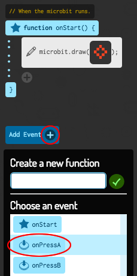

Any code added inside this event will run when the 'A' button on your micro:bit is pressed.

+ Drag another `draw` block inside your new event, and select the happy face pattern.

+ Test our your new code in the editor, by clicking 'run'. Press the 'A' button and you should see a happy face on your micro:bit.

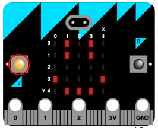

You can also test out your new code on your micro:bit.

## Save your project { .save }

## Challenge: Displaying a sad face {.challenge}
Can you make your micro:bit display a sad face then the 'B' button is pressed? You'll need to create a new event to do this.

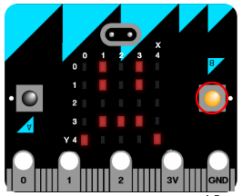

## Save your project { .save }

# Step 3: Creating a simple animation { .activity }

Let's create a (very) simple animation for your happy and sad faces.

## Activity Checklist { .check }

+ Add a second `draw` block to your `onPressA` event, with a neutral face.

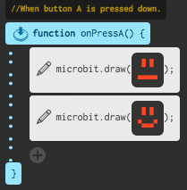

+ If you run this code to test it, you'll notice that you don't see the first pattern. To fix this, you'll need to add a `wait` block between the two images being displayed.

To find the `wait` block, click the 'Language' icon on the left of the editor.

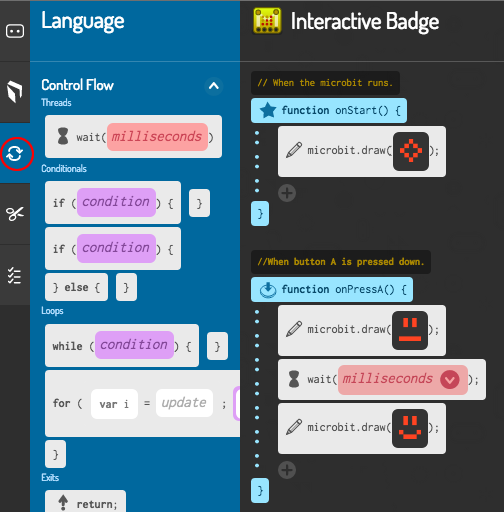

+ To choose how many milliseconds to wait, click the down-arrow and enter a number. 1000 milliseconds is 1 second, so 250 milliseconds is a quarter of a second.

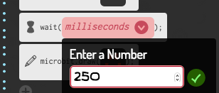

This is how your code should look:

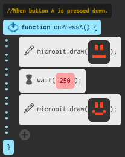

+ You'll also need to animate your sad face. The easiest way to do this is to copy the blocks you've just created. Drag the neutral face `draw` block __and__ the `wait` block to the left of the editor, into the 'Copy to snippets' area.

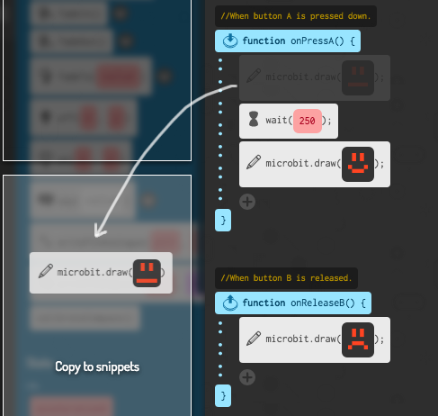

+ If you click the 'Snippets' icon, you should see your 2 blocks.

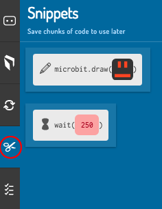

+ You can then drag these blocks into your `onPressB` event. This is how your code should look:

+ Test your code, and you should see your animated happy and sad faces!

## Save your project { .save }

## Challenge: Create your own interactive badge! {.challenge}
Create your own badge - you can use any images or animations you like!

## Save your project { .save }

