# Introduction { .intro }

You are going to code your micro:bit to tell you how compatible you are with your friends.

# Step 1: Pressing buttons together { .activity }

Let's start your program when the A and B buttons are pressed together.

## Activity Checklist { .check }

+ Go to <a href="http://jumpto.cc/mb-new" target="_blank">jumpto.cc/mb-new</a> to start a new project in the Code Kingdoms editor. Call your new project 'Rate Your Mates'.

+ When the micro:bit starts, display an image showing that both buttons should be pressed.

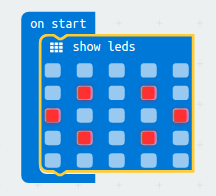

You can use scrolling text instead of an image if you prefer.

+ A rating shouldn't be shown until __both buttons are pressed__. Add a new `onPressAandB` event to your project.

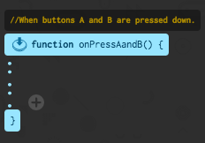

+ Add code to show a question mark for 1 second, to build the suspense before giving the friends their rating.

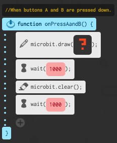

+ Test our your code. When you press buttons __A and B together__, a question mark should flash onto the screen.

# Step 2: Displaying a rating { .activity }

Show a friendship rating on the screen.

## Activity Checklist { .check }

+ Click the 'Globals' library, and create a new variable called `rating`.

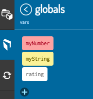

+ Drag your variable to the end of your `onPressAandB` code.

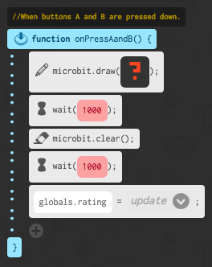

+ Click the 'Random' library, and use the random block to set the rating to a random number between 0 and 100.

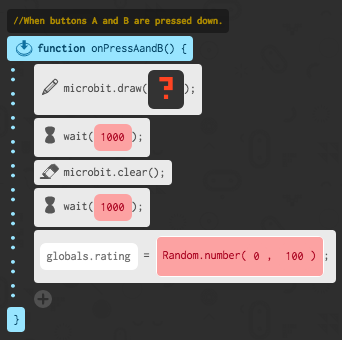

+ Add code to `say` the rating to the screen.

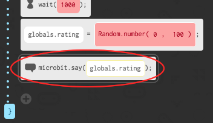

+ Finally, after a delay, display the instructions again.

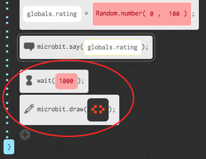

+ Test your code. Now, if you press buttons A and B together, a random rating should be displayed.

# Step 3: Best mates { .activity }

Let's display a heart when 2 friends have a high rating.

## Activity Checklist { .check }

+ Add an `if` block to your code, just before the instructions are shown.

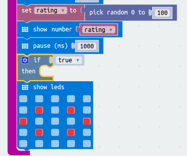

+ You want to display a heart if the rating is high (say over 75). To do this, click the down arrow in your `if` block.

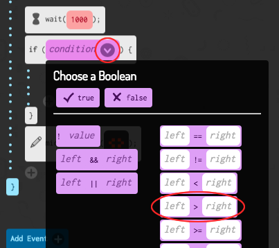

+ Drag your `rating` variable into the left side of your `if` block, and add the number `75` to the right side.

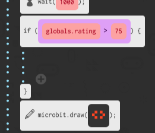

Any code inside this `if` block will run if the rating is over 75.

+ Show a heart image on the screen for 1 second if the rating is over 75.

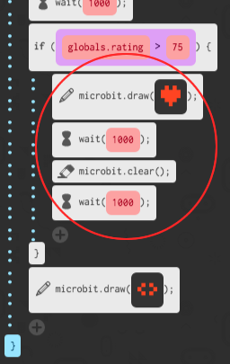

+ Test your code. Does an image of a heart show if the rating is over 75? You might have to try a few times to test it!

## Challenge: Low rating { .challenge }
Can you display a cross or a sad face for a rating under 25?

# Step 4: Adding an animation { .activity }

Let's display short animations in your program.

## Activity Checklist { .check }

+ Here's the code for displaying a question mark for 1 second before clearing the screen:

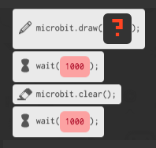

+ To make this question mark flash 5 times, you'll need to put this code inside a `for` loop.

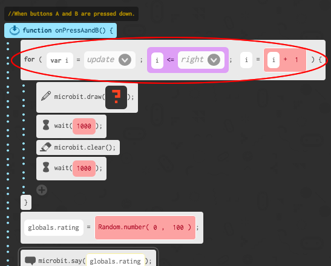

+ Finally, you just need to tell the `for` loop to start at `1`, and count up to `5`. This will make the code repeat 5 times.

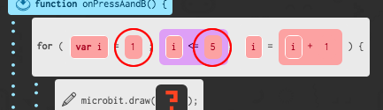

## Challenge: More animations { .challenge }
Can you make your other images flash on the screen?
