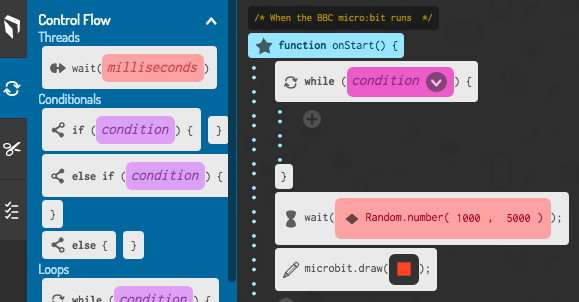
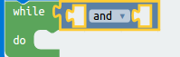
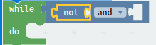
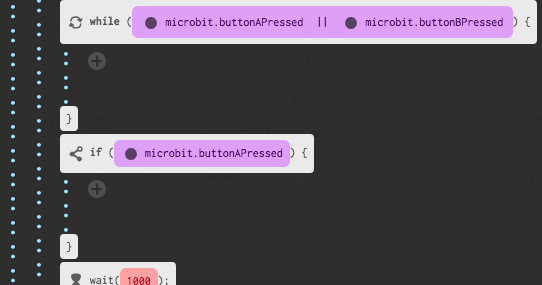
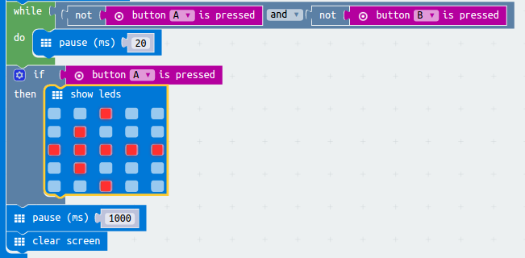

# Introduction { .intro }

You are going to create a 2-player game to see who has the fastest reactions. The game will work by showing an image after a random amount of time - whoever presses their button first is the winner.

__Instructions__: If you're reading this online, wait for an image to display on the micro:bit below and then press __A__ or __B__ first to see who is the fastest.

<iframe style="position:absolute;top:0;left:0;width:100%;height:100%;" src="https://pxt.microbit.org/---run?id=50800-81674-84873-32898" allowfullscreen="allowfullscreen" sandbox="allow-popups allow-scripts allow-same-origin" frameborder="0"></iframe>

# Step 1: Wait for it! { .activity }

Let's start by displaying an image after a random amount of time.

## Activity Checklist { .check }

+ Go to <a href="http://jumpto.cc/pxt-new" target="_blank">jumpto.cc/pxt-new</a> to start a new project in the PXT editor. Call your new project 'Reaction'. 

+ Before displaying an image, the game should wait for a random amount of time.

Drag a `pause` block into the `forever` block and change the pause time to 1000 ms:

+ Add another `pause` block and then drag a `pick random` block to `pause` block and set its value to 4000:

Remember that 1000ms is 1 second, so there will be a pause of at least second up to a maximum of 5 seconds (1000 + 4000 ms).

You can change the '1000' and '4000' numbers to change the minimum and maximum pause if you like. 

+ After waiting, your game should show an image so that players know when to press their button.

+ Click 'run' to test your project. You should see your image appear after a random delay.

+ Add code at the end of the `forever` loop to display your image for 1 second and then clear the display.

+ Test your project. You should see your image appear randomly and then disappear.

## Challenge: Choose your own image { .challenge }
Can you change the image that's displayed?

## Challenge: Choose your own delay { .challenge }
Change the numbers in your `random` block. You can speed up your game to make it harder, or slow it down to add suspense!

# Step 2: Waiting for a winner { .activity }

Let's add code to wait until a button is pressed.

## Activity Checklist { .check }

+ After displaying an image, you'll need to wait until someone presses their button.

Another way of saying this is that you'll need to wait as long as button A __and__ button B have __not__ been pressed.

To do this, add a `while` loop from the 'Control' section. The `while` loop should be added in just after the `draw` block.

+ Drag an `and` block from 'Logic' to your `while` block:

+ Drag a `not` from 'Logic' into the left hand side of the `and`:

+ Drag an `button A is pressed` block from 'Input' to after the `not`:

+ Repeat the 2 steps above to add `not button B is pressed` into the `right` side of your while loop.

+ You can then add a very short (20ms) delay, so that your `while` loop waits as long as a button hasn't been pressed.

+ Test your project. Your game should now display an image and then wait as long as buttons A __and__ B have __not__ been pressed.

# Step 4: Who is the fastest? { .activity }

Let's find out who pressed their button first.

## Activity Checklist { .check }

+ If button A was pressed, we want to point to player A. To do this, add an `if` block after your `while` loop, and replace `test` with `button A is pressed`.

+ You can then use the `show leds` block to show an arrow pointing to player A.

+ You should also do the same for button B.

## Challenge: Keep score { .challenge }
Can you use two variables called `playerA` and `playerB` to keep track of each player's score?

You'll need to set both scores to 0 at the start of the game by placing code inside the 'on start' block.

    

And add 1 to whichever player wins each round.

You'll also need to think of a way to display the score. 

