# Introduction { .intro }

Tu vas apprendre comment construire un chronomètre, pour que tu puisses l'utiliser pour défier tes amis&nbsp;!

__Instructions__: Si tu lis ceci en ligne, appuye sur __A+B__ sur la micro:bit ci-dessous pour remettre ton chronomètre à 0, __A__ pour déclencher ton chronomètre, et __B__ pour l'arrêter.

<iframe style="position:absolute;top:0;left:0;width:100%;height:100%;" src="https://pxt.microbit.org/---run?id=55342-38825-28229-57221" allowfullscreen="allowfullscreen" sandbox="allow-popups allow-scripts allow-same-origin" frameborder="0"></iframe>

# Etape 1&nbsp;: Configurer ton chronomètre { .activity }

Remettons ton chronomètre à 0 quand les boutons A et B sont pressés simultannément.

## Check-list de l'Activité { .check }

+ Va sur <a href="http://jumpto.cc/pxt-new" target="_blank">jumpto.cc/pxt-new</a>  pour démarrer un nouveau projet dans l'éditeur PXT. Appelle ton projet 'Chrono'.

+ Efface les blocs `au démarrage` et `toujours`, tu n'en auras pas besoin.

+ Ajoute un bloc `lorsque le bouton est pressé` et sélectionne `A+B`&nbsp;:.

	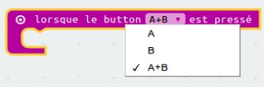

+ Clique sur 'Variables' puis 'Créer une variable', et crée une nouvelle variable appellée `temps`.

	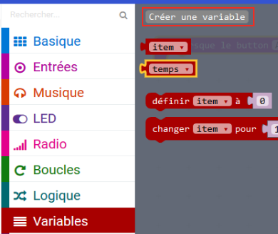

+ Quand les boutons A et B sont pressés ensemble, tu veux que `temps` ait la valeur `0`. Pour cela, place un bloc `définir` dans ton bloc `lorsque le bouton A+B est pressé`&nbsp;:

	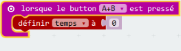

La valeur par défaut vaut zéro et c'est ce dont tu as besoin.

+ Tu devrais aussi afficher le `temps`. Pour cela, place un bloc `montrer nombre` et met ta variable `temps` dedans&nbsp;:

	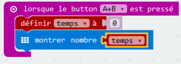

+ Clique sur 'lancer' pour tester ton code. Appuye sur le bouton 'A+B' (sous la micro:bit) pour mettre ton chronomètre à 0.

	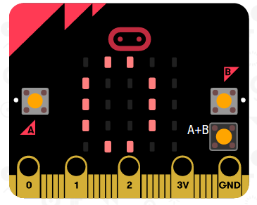

# Etape 2&nbsp;: Démarrer et arrêter ton chronomètre { .activity }

Utilisons le bouton A pour démarrer ton chronomètre, et le bouton B pour l'arrêter.

## Check-list de l'Activité { .check }

+ Ton chronomètre doit démarrer quand le bouton A est appuyé. Ajoute un nouveau bloc `lorsque le bouton A est pressé` à ton script&nbsp;:

	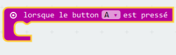

+ Le chronomètre doit compter tant que le bouton B __n'a pas été pressé__. Pour cela, place tout d'abord un bloc `lorsque` dans ton nouveau bloc `lorsque le bouton A est pressé`.

	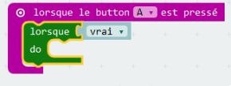

+ Place un bloc `pas`, de 'Logique' dans ton bloc `lorsque`&nbsp;:

	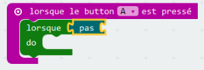

+ Tu peux alors placer un bloc `bouton B pressé` après le bloc `pas`.

	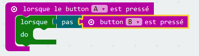

	N'importe quel code à l'intérieur de cette boucle `lorsque` sera exécuté indéfiniment, __tant que le bouton B n'est pas pressé__.

+ Ensuite, tu vas devoir ajouter 1 à ta variable `temps` à chaque seconde (1 seconde = 1000 ms). Ajoute un bloc `pause` pour forcer ton chronomètre à attendre 1 seconde.

	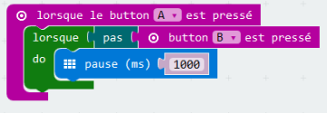

+ Pour augmenter ton variable `temps`,

	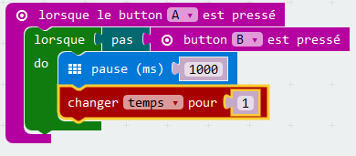

+ Enfin, tu auras besoin d'afficher la variable `temps` mise à jour. Voici ce à quoi ton code devrait ressembler&nbsp;:

	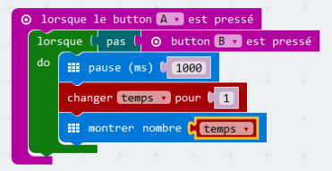

+ Clique sur 'lancer' pour tester ton code.

	+ Appuie sur les boutons A et B simultannément pour remettre ton chronomètre à 0
	+ Appuie sur le bouton A pour démarrer ton chronomètre
	+ Appuie (et garde appuyé) le bouton B pour arrêter ton chronomètre

	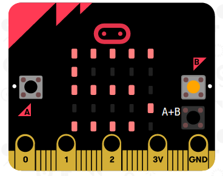

## Défie tes amis&nbsp;! { .challenge }
Utilise le chronomètre pour défier tes amis. Par exemple, tu pourras voir le temps nécessaire pour qu'ils récitent l'alphabet à l'envers, ou pour qu'ils donnent le nom de 10 capitales.

## Défi&nbsp;: Compte à Rebours { .challenge }
Peux tu créer un __nouveau__ chronomètre, qui compte à rebours jusqu'à 0 ? Voilà comment ton nouveau chronomètre devrait fonctionner&nbsp;:

+ Appuyer sur A et B simultanément doit donner la valeur 10 à ton `temps`

	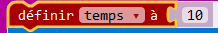

+ Appuyer sur le bouton B doit ajouter 1 à ton chronomètre

	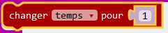

+ Appuyer sur le bouton A doit enlever 1 de ta variable `temps` jusqu'à atteindre 0. Cela signifie que tu auras besoin d'une boucle `lorsque` qui tourne aussi longtemps que `temps` est plus grand que (`>`) 0.

	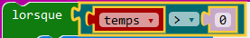

## Chronomètre de précision { .challenge }
As tu remarqué que ton chronomètre n'est pas très précis ? Cela est du au temps nécessaire pour afficher et faire défiler des nombres sur la micro:bit.

Essaye d'ajuster la pause pour améliorer le chronométrage. Tu peux utiliser un bloc `si/alors` pour avoir une pause plus courte pour les nombres plus grands qui prennent plus de temps à faire défiler.

