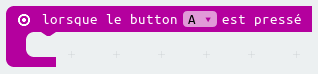
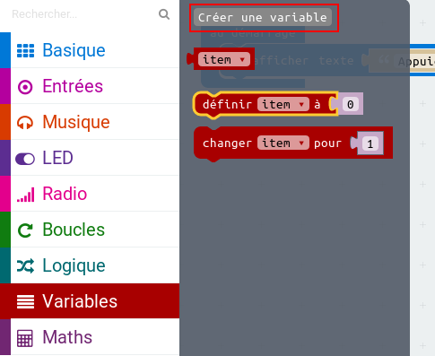
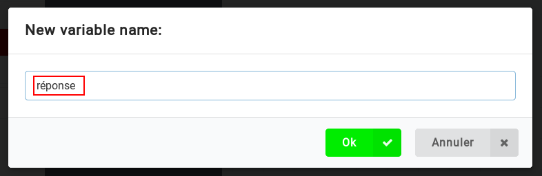
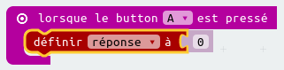
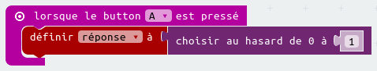
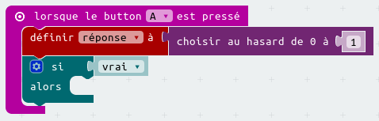
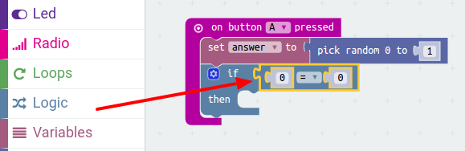
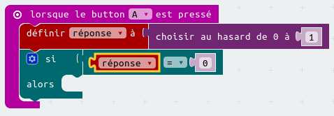
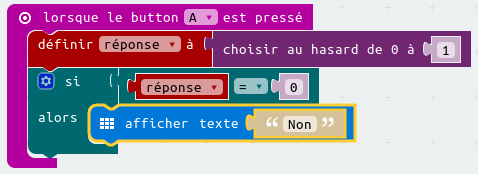
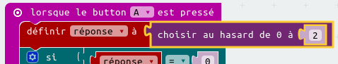

# Introduction { .intro }

Tu vas utiliser ta micro:bit pour prédire le futur&nbsp;!
Pose simplement une question à ta micro:bit, et appuie sur un bouton pour découvrir la réponse&nbsp;!

__Instructions__&nbsp;: Si tu lis ceci en ligne, pose une question à la micro:bit ci-dessous et appuie sur __A__ pour voir sa réponse&nbsp;!

<iframe style="position:absolute;top:0;left:0;width:100%;height:100%;" src="https://pxt.microbit.org/---run?id=18828-96734-17356-00995" allowfullscreen="allowfullscreen" sandbox="allow-popups allow-scripts allow-same-origin" frameborder="0"></iframe>

# Etape 1&nbsp;: Faire défiler du texte { .activity }

Commençons par afficher les instructions sur ta micro:bit sous forme d'un texte qui défile.

## Check-list de l'activité { .check }

+ Va sur <a href="http://jumpto.cc/pxt-new" target="_blank">jumpto.cc/pxt-new</a> pour démarrer un nouveau projet avec l'éditeur PXT.
  Appelle ton projet 'Diseuse de bonne aventure'.

Tu peux supprimer le bloc `toujours` en le déplaçant sur la palette, tu n'en auras pas besoin pour ce projet.

+ Place un bloc `afficher texte` à l'intérieur du bloc `au démarrage`.

+ Teste ton code.
  Tu peux le tester sur l'émulateur ou bien sur la micro:bit elle-même.

## Enregistre ton projet { .save }

# Etape 2&nbsp;: Prendre un décision { .activity }

Laissons la micro:bit prendre une décision en choisissant un nombre au hasard (`0` pour 'Non' et `1` pour 'Oui')

## Check-list de l'activité { .check }

+ Ajoute un nouvel événement `lorsque le bouton A est pressé` dans ton code.

+ Créons une variable pour stocker la réponse.
  Clique sur 'Variables', puis sur 'Créer une variable'.

+ Nomme la nouvelle variable `réponse`.

+ Place un bloc `définir à` depuis Variables dans ton bloc `lorsque le bouton A est pressé`,
  et sélectionne la variable `réponse`.

Comme tu peux le voir, le `à` dans le bloc signifie que tu dois régler la réponse à afficher.

+ Clique sur 'Math' et place un bloc `choisir au hasard entre 0 et ...` après le `à`.

+ Configure le bloc `choisir au hasard` pour qu'il prenne un nombre entre 0 et 1.
  Voici à quoi devrait ressembler ton code&nbsp;:

+ Ensuite, tu veux afficher le mot `Non` sur la micro:bit seulement `si` la `réponse` vaut 0.

Pour cela, place un bloc `si` tout en bas de l'événement `lorsque le bouton A est pressé`&nbsp;

+ Place un bloc `=` en tant que condition dans le bloc `si`&nbsp;:

+ Place ta variable `réponse` dans la partie gauche de la condition du bloc `si`.

+ Le code placé à l'intérieur du bloc `si` ne s'exécutera que si la `réponse` vaut 0.
   Etant donné que le 0 correspond à `Non`, ajoutons un autre bloc `afficher texte`.

+ Teste ton code&nbsp;
	+ Parfois la `réponse` vaudra 0, et la micro:bit devra dire 'Non'.
	+ Parfois la `réponse` vaudra 1, et rien ne se passera&nbsp;!

## Enregistre ton projet { .save }

## Défi&nbsp;: Plusieurs réponses {.challenge}

Sauras-tu afficher 'Oui' sur ta micro:bit __si__ la `réponse` est 1&nbsp;?
Tu peux même changer le texte affiché par quelque chose de plus intéressant que juste 'Oui' ou 'Non'&nbsp;!

Tu peux même faire en sorte que ta micro:bit dise quelque chose comme 'Peut être' ou 'Demande encore' si la réponse est 2.
Pour que cela fonctionne, tu devras aussi changer ton code pour choisir une valeur entre 0 et 2&nbsp;!

Astuce&nbsp;: tu peux faire un clic-droit sur un bloc `si` pour dupliquer ce bloc et son contenu.

## Enregistre ton projet { .save }

## Défi&nbsp;: Secoue ta micro:bit {.challenge}

Peux-tu programmer ta micro:bit pour qu'elle prenne une décision lorsqu'on la secoue au lieu de lorsque un bouton est pressé.

## Enregistre ton projet { .save }