# Introduction { .intro }

Tu vas faire un jeu dans lequel les joueurs devront guider un baguette le long d'un circuit sans le toucher.
Toucher ajoutera un au score du joueur, le joueur avec le plus petit score gagne&nbsp;!

__Instructions__&nbsp;: Si tu lis ceci en ligne , appuie sur  __A__  sur la micro:bit ci-dessous pour démarrer le jeu, puis touche la broche __0__ pour faire une connexion.

<iframe style="position:absolute;top:0;left:0;width:100%;height:100%;" src="https://pxt.microbit.org/---run?id=71088-38400-20107-39742" allowfullscreen="allowfullscreen" sandbox="allow-popups allow-scripts allow-same-origin" frameborder="0"></iframe>

Pour ce projet, tu auras besoin de&nbsp;:

+ Fil de fer  (environ 50cm);
+ Pâte à modeler
+ Ruban adhésif isolant (optionnel);
+ Pinces Crocodile (optionnel).

# Etape 1: Stocker les échecs { .activity }

Commençons par créer un endroit où stocker le nombre d'échecs.

## Check-list de l'activité { .check }

+ Va sur <a href="http://jumpto.cc/pxt-new" target="blank">jumpto.cc/pxt-new</a> pour démarrer un nouveau projet dans l'éditeur PXT.
  Appelle ton nouveau projet 'Frustration'.

+ Supprime les blocs `toujours` et `au démarrage ` en les déplaçant sur la palette, dans la corbeille&nbsp;:

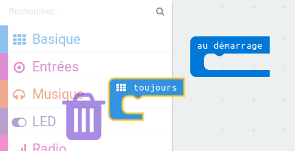

+ Une nouvelle partie commence quand le joueur appuie sur le bouton A.
  Clique sur 'Entrée', puis `lorsque le bouton A est pressé`.

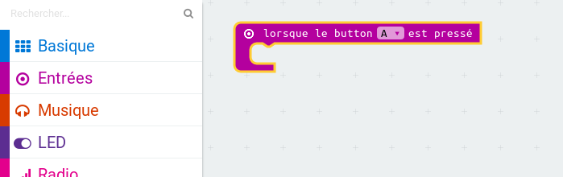

+ Maintenant tu as besoin d'une variable pour stocker le nombre de fois où tu vas échouer et toucher le fil avec la baguette.
  Clique sur 'Variables', puis 'Créer une variable'.
  Nomme la variable `échecs`.

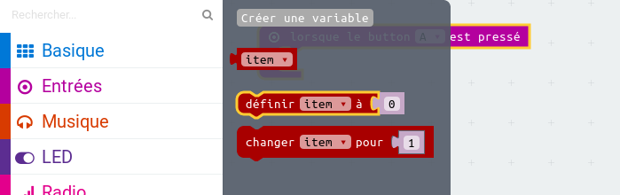

+ Place un bloc `définir ... à` depuis 'Variables' et sélectionne `échecs`&nbsp;:

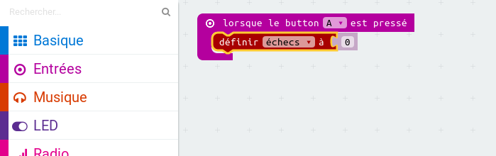

Ceci mettra à zéro le nombre d'échecs quand on appuie sur le bouton A.

+ Enfin, tu peux afficher le nombre d'`échecs` sur ta micro:bit.
  Pour cela, place un bloc `montrer nombre`, depuis 'Basique', à la fin du script.

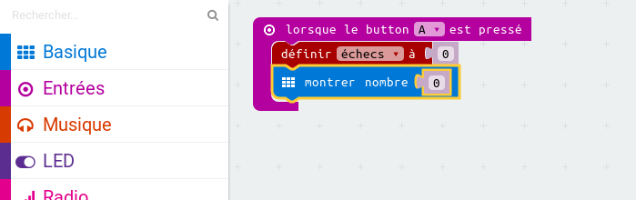

+ Ensuite place `échecs` depuis 'Variables' dans le bloc `montrer nombre`.

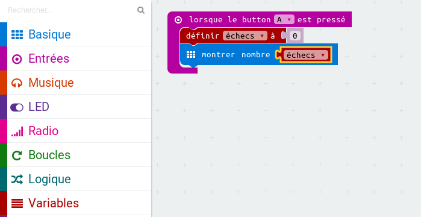

+ Clique sur 'lancer' pour tester ton script.
  Cliquer sur le bouton A devrait afficher le nombre d'échecs, qui a été mis à `0`.

## Défi: Afficher une image { .challenge }

Sauras-tu afficher une image pendant 1 seconde (1000ms) avant que le nombre d'`échecs` soit affiché&nbsp;?

Tu devras utiliser les blocs suivants depuis Basique pour atteindre ton but&nbsp;:

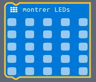

# Etape 2: Compter le nombre d'échecs { .activity }

Ajoutons le code qui compte le nombre d'échecs.

## Check-list de l'activité { .check }

+ Tu vas ajouter 1 à la variable `fails` chaque fois qu'une connexion est faite sur la broche P0.
  Pour cela, prend un bloc `lorsque le pin P0 est pressé` dans 'Entrées'.

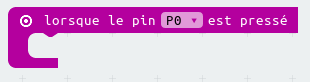

+ Ensuite, ajoute 2 blocs pour afficher une croix pendant 1 seconde lorsque la broche P0 est pressée.

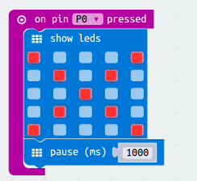

+ Tu devras ensuite ajouter 1 à la variable `échecs`.
  Pour cela, prend un bloc `changer item par 1` dans 'Variables' et remplace `item` par `échecs`.

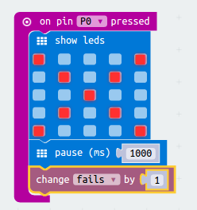

+ Enfin, tu peux ajouter le code pour afficher le nombre d'`échecs` mis à jour.
  Voilà à quoi devrait ressembler ton code.

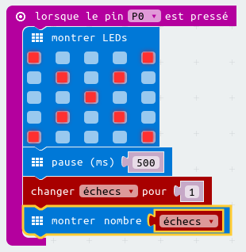

+ Teste ton code en appuyant sur le bouton A de l'émulateur pour démarrer le jeu.
  Chaque fois que tu appuies sur la broche P0, tu devrais voir la variable `échecs` augmenter de 1.

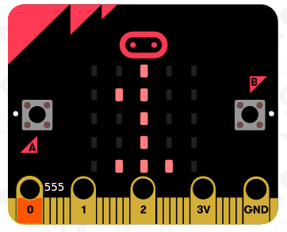

+ Clique sur 'Télécharger' et transfère ton script sur ta micro:bit.
  Tu peux appuyer sur la broche P0 en fermant le circuit.
  Pour cela, place ton pouce droit sur la masse (broche GND) et touche la broche P0 avec ton pouce gauche.

# Etape 3: Construit ton jeu { .activity }

Maintenant que tu as programmé ton jeu, assemblons tout ensemble&nbsp;!

## Check-list de l'activité { .check }

+ D'abord, créons une baguette.
  Prend un morceau de fil de fer d'environ 20cm de long et replie-le en deux, en créant un boucle à l'extrémité.

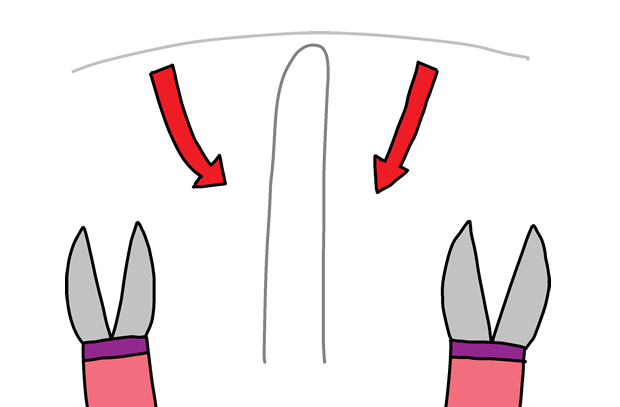

+ Tu peux ensuite entortiller les 2 extrémités du fil ensemble.

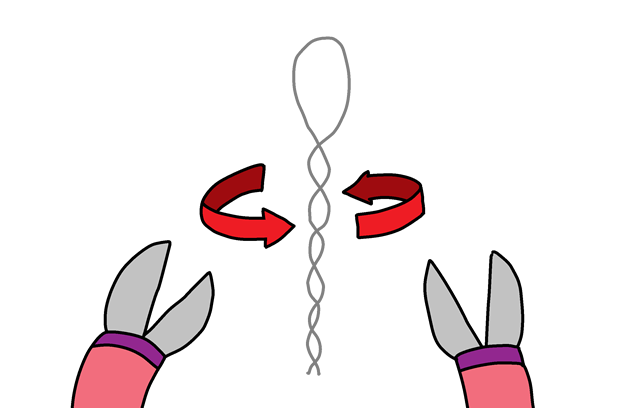

+ Pour faire le circuit, prend une autre morceau de fil d'environ 30cm de long et tord la partie centrale du fil pour lui donner une forme biscornue.
  Tu devras tordre vers le haut une des extrémités du circuit.

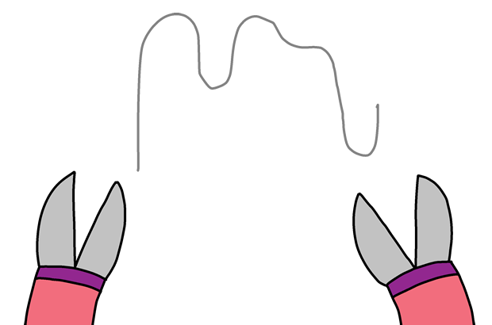

+ Si tu as du ruban adhésif isolant, enveloppe les 2 extrémités du circuit,
  en laissant dépasser un peu de métal à chacune des extrémités.

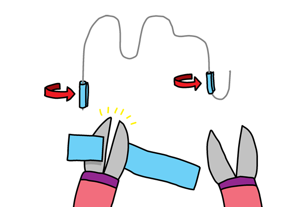

+ Enfile ta baguette sur le circuit, et pique une des extrémités du fil dans la pâte à modeler pour que le circuit tienne debout tout seul.

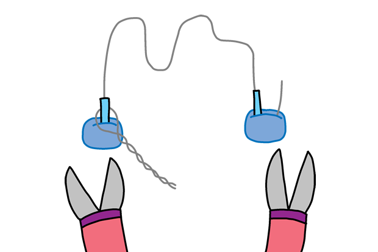

+ Tu peux brancher ton jeu à ta micro:bit en utilisant des pinces crocodiles.
  Connecte d'abord la masse (broche GND) à l'une des extrémités du circuit.

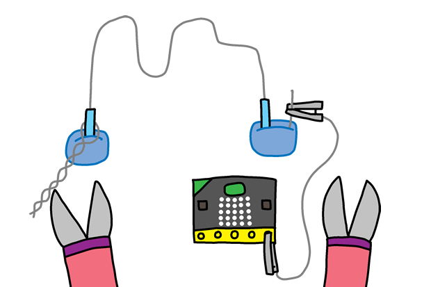

+ Tu peux ensuite connecter la broche P0 à ta baguette.

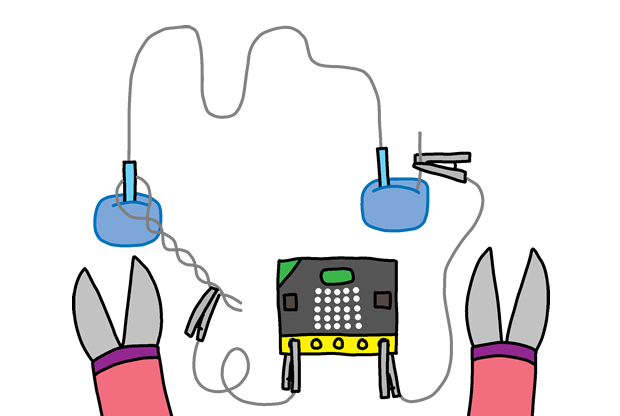

+ Teste ton jeu.
  Appuie sur le bouton A et ton score sera remis à 0.
  Chaque fois que ta baguette touche le circuit, le courant passe entre la baguette et le circuit et ta micro:bit ajoute 1 au nombre d'échecs.

## Défi: Mode triche&nbsp;! { .challenge }

Sauras-tu ajouter un peu de triche dans ton jeu, et faire en sorte qu'appuyer sur le bouton B diminue le score 1&nbsp;?

## Défi: Personnalise ton jeu { .challenge }

Demande à tes amis d'essayer ton jeu.
Si ton jeu est trop facile, tu peux le rendre plus corsé en &nbsp;:

+ Créant un circuit plus long,
+ En ajoutant plus de virages dans ton circuit,
+ En réduisant la taille de la boucle de ta baguette.
