# Introduction { .intro }

Tu vas faire un badge interactif, qui réagit à l'humeur de tes amis.

__Instructions__: Si vous lisez ceci en ligne, appuyez sur le bouton __A__ de la micro:bit ci-dessous pour afficher un sourire, et sur le bouton __B__ pour montrer de la tristesse.

<iframe style="position:absolute;top:0;left:0;width:100%;height:100%;" src="https://pxt.microbit.org/---run?id=90418-17495-16581-63753" allowfullscreen="allowfullscreen" sandbox="allow-popups allow-scripts allow-same-origin" frameborder="0"></iframe>

# Etape 1: Affiche une image { .activity }

Commençons par afficher une image sur la micro:bit quand elle démarre.

## Check-list de l'activité { .check }

+ Va sur <a href="http://jumpto.cc/pxt-new" target="blank">jumpto.cc/pxt-new</a> pour démarrer un nouveau projet dans l'éditeur PXT. Appelle ton nouveau projet 'Badge interactif'.

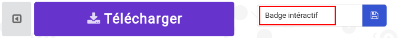

+ Tu dois maintenant voir l'éditeur de code. Pour dessiner une image sur ta micro:bit quand elle démarre, place un bloc `montrer LEDs` dans la zone de code (sur la gauche) à l'intérieur du bloc `au démarrage`.

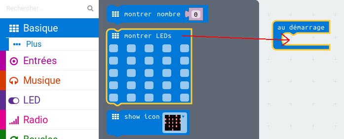

+ Pour créer une image à afficher, clique sur les LEDs que tu veux allumer&nbsp;:

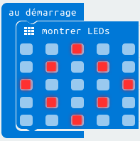

+ Ton code s’exécutera automatiquement dans l'émulateur sur la gauche.&nbsp;:

+ Tu peux aussi tester ton code sur la micro:bit elle même&nbsp;! Pour cela, clique sur 'Télécharger' dans le menu à gauche de l'écran.

Cela va créer et télécharger un fichier `.hex` que tu pourras exécuter sur ta micro:bit.

+ Utilise un cable USB pour brancher ta micro:bit sur ton ordinateur. Tu devrais voir apparaître ta micro:bit dans le gestionnaire de fichiers, sous la forme d'une clé USB.

+ Si tu utiliser l'uploader micro:bit alors le fichier `.hex` sera automatiquement copié sur la micro:bit. Demande à un bénévole si tu n'es pas sûr.

Sinon tu devras copier le fichier `.hex` sur la micro:bit.

Si tu utilises __Internet Explorer__ tu peux sélectionner `Enregistrer sous` dans le menu qui apparaît au bas de ton navigateur, puis sélectionner le disque micro:bit&nbsp;:

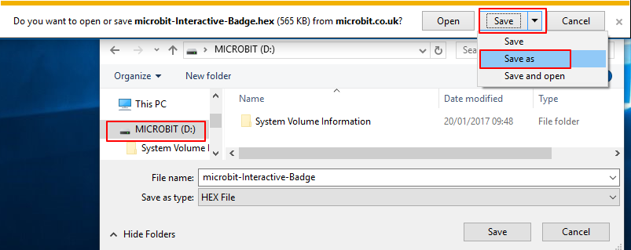

Si tu utilises  __Google Chrome__ tu peux cliquer sur la flèche à côté du fichier et choisir 'Afficher dans le dossier', puis déplacer le fichier sélectionné sur le disque micro:bit&nbsp;:

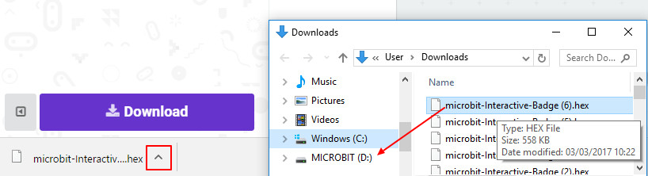

+ Une lumière à l'arrière de ta micro:bit va clignoter pendant quelques instants, le tant que le fichier soit copié. Une fois que c'est terminé, ton programme va démarrer. Tu peux cliquer sur le bouton reset à l'arrière de ta micro:bit pour redémarrer le programme.

+ Tu devrais maintenant voir ton image sur la micro:bit.
  Si tu préfères, tu peux enlever le cable USB de ta micro:bit, et la brancher sur des piles.
  Le programme enregistré sur la micro:bit va démarrer.

## Enregistre ton programme { .save }

Tu n'as pas besoin d'un compte pour enregistrer ton programme&nbsp;! Ton projet sera automatiquement dans ton navigateur, tu peux cliquer sur `Projets` pour voir tes projets.

Tu peux aussi cliquer sur Enregistrer pour télécharger ton projet sous la forme d'un fichier `.hex` qui contient ton programme&nbsp;:

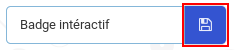

Pour charger ton projet sur un autre ordinateur, clique sur 'Projets', puis sur 'Importer un fichier' et sélectionne ton fichier `.hex`.

# Etape 2: Affiche un sourire { .activity }

Montrons maintenant un sourire sur ta micro:bit quand le bouton 'A' est pressé.

## Check-list de l'activité { .check }

+ Jusqu'ici, tu as seulement exécuté du code au démarrage de la the micro:bit. Tu peux aussi exécuter du code quand un bouton est pressé.

Place un bloc `Lorsque le bouton est pressé` et vérifie que le bouton A est sélectionné&nbsp;

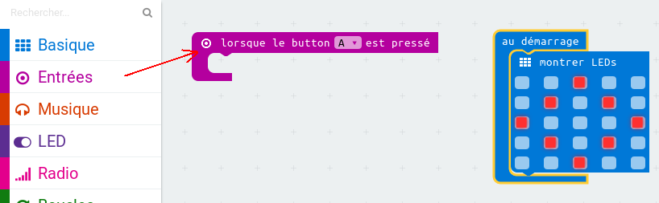

Tout le code ajouté à l'intérieur de ce bloc ne s'exécutera que lorsque le bouton 'A' de ta micro:bit sera pressé.

+ Place un bloc `montrer LEDs` à l'intérieur de ton nouvel événement, pour dessiner un visage souriant.

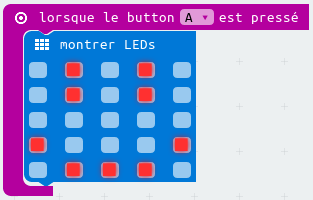

+ Teste ton code dans l'émulateur. Clique sur le bouton 'A' et tu devrais voir apparaître un visage souriant sur ta micro:bit&nbsp;:

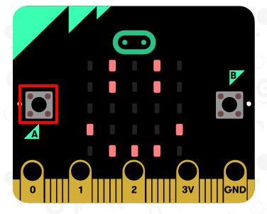

Tu peux aussi tester ton code sur ta micro:bit.

## Enregistre ton projet { .save }

## Challenge: Affiche un visage triste {.challenge}

Est-ce que tu peux faire en sorte que ta micro:bit affiche un visage triste quand le bouton 'B' est pressé&nbsp;?
Tu devras utiliser un autre bloc 'lorsque le bouton est pressé' et sélectionner 'B'.

## Enregistre ton projet { .save }

# Etape 3: Crée une animation simple { .activity }

Créons une animation (très) simple pour tes visages souriants et tristes.

## Check-list de l'activité { .check }

+ Ajoute un second bloc `montrer LEDs` dans ton bloc `lorsque le bouton A est pressé`, avec un visage neutre.

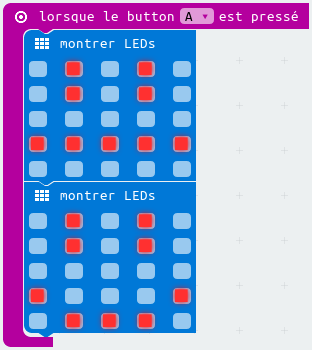

+ Si tu teste ce code, tu verras que le dessin change rapidement. Pour que le changement soit plus lent, tu devras ajouter un bloc  `pause` entre les 2 images affichées.

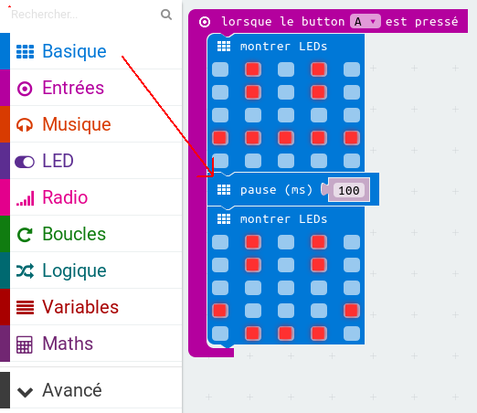

Pour choisir combien de millisecondes attendre, clique sur la flèche vers le bas et saisit un nombre. 1000 millisecondes c'est 1 seconde, donc 250 millisecondes c'est un quart de seconde.

+ Tu devras aussi animer ton visage triste. La façon la plus simple d'y arriver est de dupliquer les blocs que tu viens juste de créer. Tu remarqueras que l'éditeur PXT duplique seulement un seul bloc à la fois (et pas plusieurs blocs comme dans Scratch).

+ Tu peux ensuite déplacer ces blocs dans ton bloc `lorsque le bouton B est pressé`. Voilà à quoi devrait ressembler ton code&nbsp;:

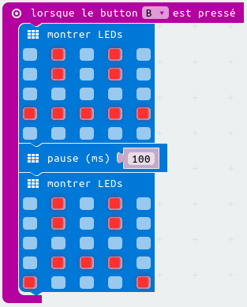

+ Teste ton code, et tu devrais voir un visage souriant ou triste animé quand tu appuies sur le bouton A ou B.

## Enregistre ton projet { .save }

## Défi&nbsp;: Crée ton propre badge interactif&nbsp;! {.challenge}

Crée ton propre badge, tu peux utiliser les images ou les animations que tu souhaites&nbsp;!

## Enregistre ton projet { .save }

