# Introduction { .intro }

Tu vas programmer ta micro:bit pour quelle indique si tu es compatible avec tes amis.

__Instructions__&nbsp;: Si tu lis ceci en ligne, appuie sur __A+B__ de la micro:bit ci-dessous avec un ami pour découvrir la force de ton amitié.

<iframe style="position:absolute;top:0;left:0;width:100%;height:100%;" src="https://pxt.microbit.org/---run?id=57756-45098-79806-84952" allowfullscreen="allowfullscreen" sandbox="allow-popups allow-scripts allow-same-origin" frameborder="0"></iframe>

# Etape 1&nbsp;: Appuyer sur les deux boutons ensemble { .activity }

Commençons le programme quand les boutons A et B sont pressés ensemble.

## Check-list de l'activité { .check }

+ Va sur <a href="http://jumpto.cc/pxt-new" target="_blank">jumpto.cc/pxt-new</a> pour démarrer un nouveau projet dans l'éditeur PXT.
  Appelle ton nouveau projet 'Note tes potes'.

+ Quand la micro:bit démarre, affiche une image pour montrer que les deux boutons doivent être pressés simultanément.

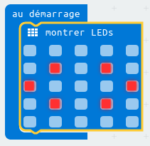

Tu peux utiliser du texte qui défile ou bien une image si tu préfères.

+ Une note ne doit pas être affichée tant que __les deux boutons sont pressés__.
  Ajouter un événement `lorsque le bouton A+B est pressé` dans ton projet.

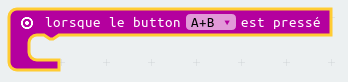

+ Ajoute le code pour afficher un point d'interrogation pendant 1 seconde, pour faire durer le suspense avant de révéler aux amis la force de leur amitié.

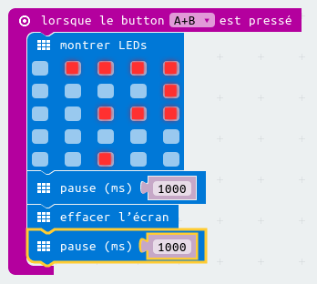

+ Teste ton code.
  Quand tu appuies sur les boutons __A et B ensemble__, un point d'interrogation devrait clignoter sur l'écran.

# Etape 2&nbsp;: Afficher la note { .activity }

Affiche la force de l'amitié sur l'écran.

## Check-list de l'activité { .check }

+ Clique sur 'Variables' et ajoute une variable appelée `amitié`.

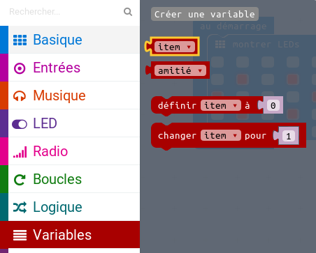

+ Ajoute un bloc `définir ... à` à la fin du bloc `lorsque le bouton A+B est pressé` est sélectionne la variable `amitié`&nbsp;:

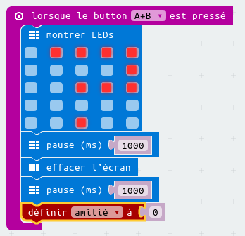

+ Clique sur 'Math', et utilise un bloc `choisir au hasard entre 0 et ...` pour définir l'amitié, en prenant un nombre aléatoire entre 0 et 100.

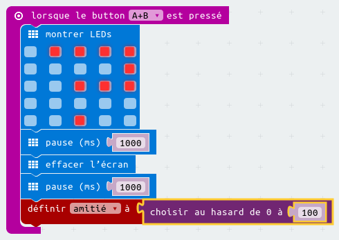

+ Ajoute le code pour afficher l'`amitié` sur l'écran.

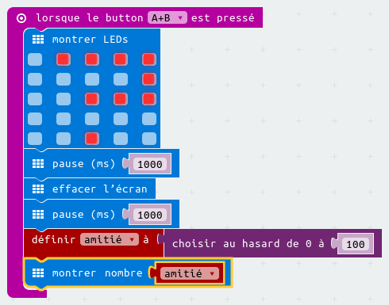

+ Enfin, après un délai, affiche les instructions à nouveau.
  Souviens-toi que tu peux utiliser le clic-droit puis 'Dupliquer' pour copier un bloc.

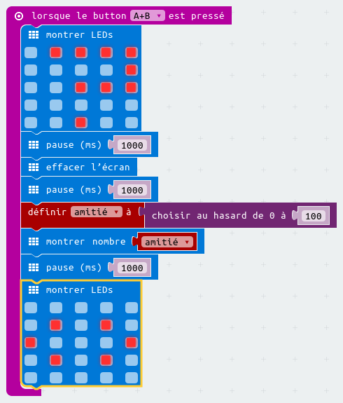

+ Teste ton code. Maintenant, si tu presses les boutons A et B ensemble, un nombre au hasard devrait s'afficher.

# Etape 3&nbsp;: Les meilleurs potes { .activity }

Affichons un coeur quand deux amis ont une grande amitié.

## Check-list de l'activité { .check }

+ Ajoute un bloc de code `si` dans code, juste avant l'affichage des instructions.

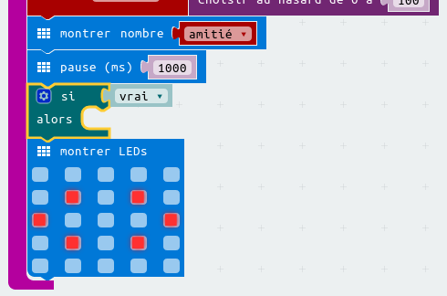

+ Tu veux afficher un coeur si l'`amitié` est est grande (disons supérieure à 75).
  Pour cela, dans 'Logique' prend un bloc de comparaison et met le dans ton `si`, puis sélectionne '>'&nbsp;:

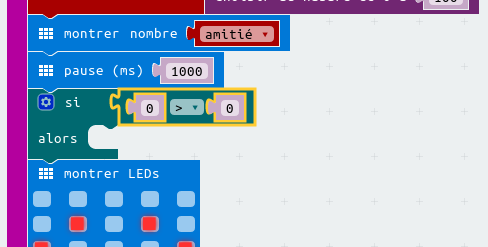

+ Place la variable `amitié` dans le partie gauche de ton bloc `si`, et mets le nombre `75` dans la partie droite.

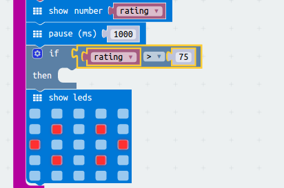

Le code à l'intérieur du bloc `si` ne s'exécutera que si l'`amitié` est supérieure à 75.

+ Affiche une image avec coeur sur l'écran pendant 1 seconde si l'`amitié` est supérieure à 75.

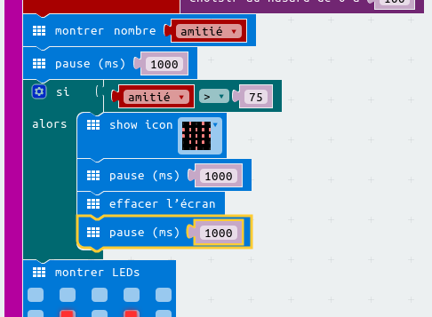

+ Teste ton code.
  Est-ce qu'une image de coeur apparaît si l'`amitié` est supérieure à 75&nbsp;?
  Tu peux essayer plusieurs fois pour tester&nbsp;!

## Défi&nbsp;: Mauvaise note { .challenge }

Sauras-tu afficher une croix ou un visage triste pour une valeur de `amitié` inférieure à 25&nbsp;?

# Etape 4&nbsp;: Ajouter des animations { .activity }

Ajoute de petites animations dans ton programme.

## Check-list de l'activité { .check }

+ Voici le code pour afficher un point d'interrogation pendant 1 seconde avant d'effacer l'écran&nbsp;:

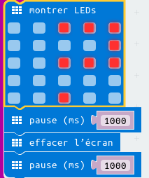

+ Pour faire clignoter ce point d'interrogation 5 fois, tu devras mettre ce code à l'intérieur d'une boucle `répéter` et régler le nombre de répétition à 5.

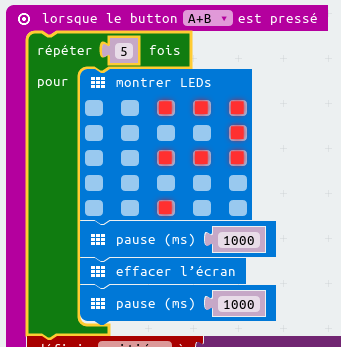

## Défi&nbsp;: Plus d'animations { .challenge }

Sauras-tu faire clignoter d'autres images sur l'écran&nbsp;?
