# Introduction { .intro }

Tu vas créer un jeu pour 2 joueurs pour voir qui a les réflexes les plus rapides. Le jeu consistera à afficher une image après un délai aléatoire : celui qui appuie sur son bouton le premier gagne.

__Instructions__&nbsp;: Si tu lis ceci en ligne, attend qu'une image apparaisse sur la micro:bit ci-dessous et vous appuiez sur __A__ or __B__ pour voir qui est le plus rapide.

<iframe style="position:absolute;top:0;left:0;width:100%;height:100%;" src="https://pxt.microbit.org/---run?id=50800-81674-84873-32898" allowfullscreen="allowfullscreen" sandbox="allow-popups allow-scripts allow-same-origin" frameborder="0"></iframe>

# Etape 1&nbsp;: A vos marques&nbsp;! { .activity }

Commençons par afficher une image après un délai d'une durée aléatoire.

## Check-list de l'activité { .check }

+ Va sur <a href="http://jumpto.cc/pxt-new" target="_blank">jumpto.cc/pxt-new</a> et démarre un nouveau projet dans l'éditeur PXT. Appelle ton  ouveau projet 'Reaction'. 

+ Avant d'afficher une image, le jeu doit attendre pendant une durée aléatoire.

Place un bloc `pause` dans le bloc `toujours` et change la valeur de pause en mettant 1000 ms&nbsp;:

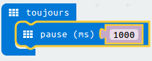

+ Ajoute un autre bloc `pause` et place un bloc `choisir au hasard` dans la valeur du bloc `pause` et met sa valeur à 4000&nbsp;:

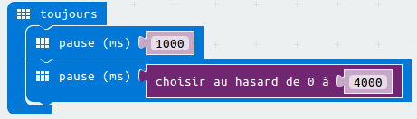

Souviens toi que 1000 ms font 1 seconde, donc il y aura une pause d'au moins une seconde et d'un maximum de 5 secondes (1000 + 4000 ms).

Tu peux faire changer les valeurs '1000' et '4000' modifier le minimum et le maximum de pause si tu le souhaites.

+ Après l'attente, le jeu doit montrer une image pour que les joueurs sachent qu'ils doivent appuyer sur leur bouton.

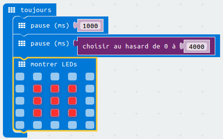

+ Clique 'lancer' pour tester ton projet. Tu devrais voir apparaître une image après un délai aléatoire.

+ Ajoute du code à la fin de la boucle `toujours` pour afficher ton image pendant 1 seconde puis effacer l'affichage.

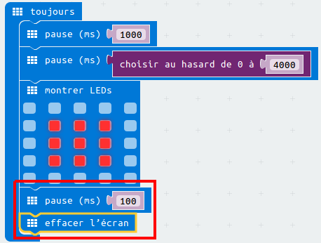

+ Teste ton projet. Tu doit voir ton image apparaître aléatoirement puis disparaître.

## Défi: Choisis ta propre image { .challenge }
Peux tu changer l'image qui s'affiche&nbsp;?

## Défi: Choisis ton propre délai { .challenge }
Modifie les valeurs de ton bloc `aléatoire`. Tu peux accélérer ton jeu pour le rendre plus difficile, ou le ralentir pour augmenter le suspense&nbsp;!

# Etape 2: Attente du gagnant { .activity }

Ajoute du code pour attendre jusqu'à ce qu'un bouton soit appuyé.

## Check-list de l'activité { .check }

+ Après avoir affiché une image, tu as besoin d'attendre jusqu'à ce que quelqu'un appuie sur son bouton.

Une autre façon de le dire serait que tu dois attendre aussi longtemps que le bouton A __et__ le bouton B n'ont __pas__ été appuyés.

Pour se faire, ajoute une boucle `lorsque` depuis la section 'Contrôle'. La boucle `lorsque` doit être ajoutée juste après le bloc `montrer Leds`.

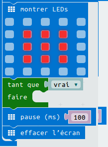

+ Place un `et` de 'Logique' dans ton bloc `lorsque`&nbsp;:

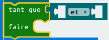

+ Place un `pas` de 'Logique' dans la partie gauche de ton `et`&nbsp;:

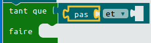

+ Place un bloc `bouton A est pressé` de 'Entrées' après le `pas`&nbsp;:

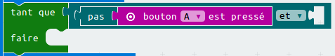

+ Répète les 2 étapes précédentes et ajoute un `pas bouton B est pressé` dans la partie `droite` de ta boucle tant que.

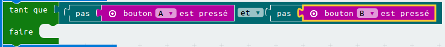

+ Tu peux ensuite ajouter un délai très court (20 ms), pour que ta boucle `tant que` attende aussi longtemps qu'un bouton n'est pas appuyé.

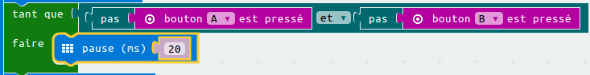

+ Teste ton projet. Ton jeu devrait maintenant afficher une image et attendre aussi longtemps que les boutons A __et__ B n'ont __pas__ été appuyés.

# Etape 4: Qui est le plus rapide&nbsp;? { .activity }

Essayons de voir qui est a appuyé son bouton en premier.

## Check-list de l'activité { .check }

+ Si le bouton A a été appuyé, nous voulons pointer vers le joueur A. Pour faire cela, ajoute un bloc `si`  après ta boucle `tant que`, et remplace `test` par `bouton A est pressé`.

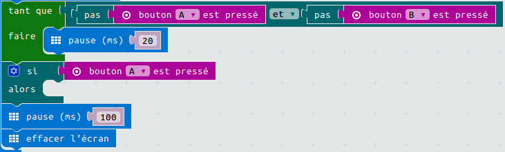

+ Tu peux ensuite utiliser le bloc `montrer LEDs` pour afficher une flèche pointant vers le joueur A.

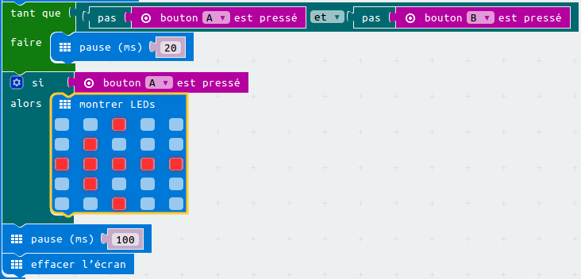

+ Tu devrais pouvoir faire de même pour le bouton B.

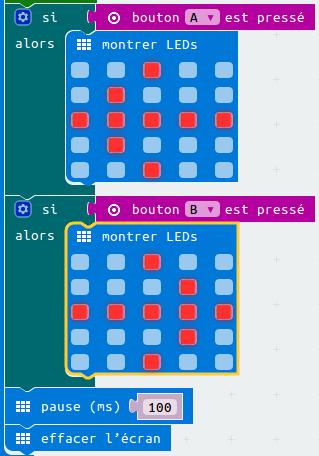

## Défi: Conserve le score { .challenge }
Peux tu utiliser deux  variables appellées `joueur1` et `joueurB` pour garder une trace du score de chaque joueur ?

Tu auras besoin de mettre les deux scores à 0 au démarrage du jeu en plaçant ton code dans le bloc 'au démarrage'.

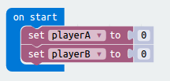

Et ajoute 1 à chaque joueur qui gagne une manche.

Tu devras penser aussi à un moyen d'afficher le score.

